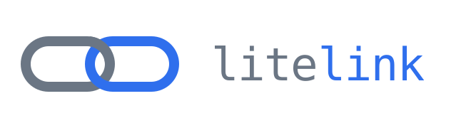

<p align="center">
  
</p>

[](https://github.com/nhobin219/litelink/actions/workflows/ci.yml)
[](LICENSE)
[](pyproject.toml)
[](https://iceberg.apache.org/)

# Durable append-only capture into Iceberg tables

**Embedded and local-first.**

## Introduction

litelink is a Python library for the thing every capture pipeline hand-rolls badly: getting a
stream of observations onto disk durably, into well-sized Parquet, and eventually into object
storage — without a daemon, a broker, or a catalog service. `append()` returns once the row is
durable, and a query a moment later sees it.

```
SQLite buffer          durable on commit. unsealed rows only.
      │  seal at target_seal_size
      ▼
local Iceberg table    a rolling window. reads land here.
      │  sync: upload data files, register into the archive
      ▼
remote Iceberg table   full history, on S3.
```

Reads span all three tiers, and the catalog is a SQLite file rather than a service, so **no
read on the hot path touches the network.** Every other machine reads the archive instead,
with any Iceberg engine and nothing from litelink.

It exists because doing this by hand goes wrong the same way every time: one production
capture system had 125,884 objects, 62.5% of them under 16 KiB, Parquet files at 2 rows each,
a compaction routine nothing ever scheduled, and an in-memory buffer a `SIGKILL` emptied.
Durable capture, file sizing and tiering are each easy alone and nobody's job together.

**Status: early.** All three tiers work, and a log survives losing its machine. Read
[what it is not](#what-it-is-not) and [not implemented yet](#not-implemented-yet) first.

## Quick start

```bash
git clone https://github.com/nhobin219/litelink && cd litelink
just bootstrap         # uv sync + git hooks + DuckDB extensions
just demo-websocket    # capture a live public feed, one process, ~30 seconds
```

You need [`uv`](https://docs.astral.sh/uv/) and [`just`](https://github.com/casey/just), and
nothing else: no producer, no credentials, no maintainer, no container. That demo is
[`examples/websocket.py`](examples/websocket.py), and this is its shape:

```python
import pyarrow as pa
from litelink import Log

# A trade feed: durable the moment it arrives, queryable a moment later.
schema = pa.schema([
    pa.field("trade_id", pa.int64()),
    pa.field("event_ts", pa.int64()),    # microseconds, as the exchange sends them
    pa.field("price", pa.float64()),
    pa.field("amount", pa.float64()),
    pa.field("side", pa.int64()),        # 0 buy, 1 sell
])

# new() takes the shape, fixed at creation. open() takes none of it — schema,
# sort order, config and archive all come from the log itself.
log = Log.new("data", "trades", schema=schema, sort_by=("event_ts",))
log.append({"trade_id": 624438572, "event_ts": 1787772776240000,
            "price": 78501.62, "amount": 0.0076, "side": 0})  # durable on return

# extend() commits the whole group in ONE transaction — one fsync for the batch,
# not one per row. That call size is the write throughput lever, and a call-site
# choice: no LogConfig setting tunes it.
log.extend(group_of_rows)                          # append(row) is extend([row])

log = Log.open("data", "trades")
log = Log.open("data", "trades", read_only=True)   # alongside a live writer

recent = log.scan(where="event_ts > 1787772776000000").read_all()
log.maintain()                                     # compact, evict, expire
```

That is the whole API surface for local capture. Everything below is optional, and every
public call is in [`docs/API.md`](docs/API.md) — one page, thirty-nine of them, and most
deployments use six.

## More demos

A synthetic feed you can drive as hard as you like, with one process per storage role:

```bash
just demo-capture      # append continuously — the hot path, and nothing else
just demo-maintain     # in another terminal: seal, compact, evict, expire
just demo-tail         # in a third: watch where the rows are
```

To add the archive tier, against a local S3-compatible store or a real bucket:

```bash
just rustfs            # object storage in one container
just demo-archive      # capture, with an archive configured
just demo-maintain     # also pushes to it, and evicts what it has pushed

cp .env.example .env   # or: set LITELINK_DEMO_ARCHIVE=s3://your-bucket/prefix
```

Credentials are not in that file unless you put them there — the library reads them from the
environment through the ordinary AWS chain, so a profile, instance metadata or SSO all work
untouched, and a log directory never carries a key with it.

To survive losing the machine, ship the SQLite WAL alongside:

```bash
just litestream        # once: fetch the pinned, checksum-verified sidecar
just demo-replicate    # generates litestream.yml from the log, runs it
```

`Log.restore(root, name, archive=...)` then rebuilds the log on another box, reserving an
offset window so nothing the dead machine served is reissued. Verified against a local
S3-compatible store and against AWS. See [`examples/`](examples/).

## Reading it from another machine

The demos above are the *writer's* read. Everywhere else reads the archive, which is an
ordinary Iceberg table publishing `version-hint.text` at every commit — so an engine pointed
at the prefix resolves the current metadata itself, with no catalog service, no `archive.db`,
no local root and no litelink install:

```sql
SELECT count(*), max(litelink_offset)
FROM iceberg_scan('s3://bucket/prefix/litelink/trades',
                  version_name_format = '%s%s.metadata.json');
```

`litelink_offset` is monotonic and never reused, so a reader keeps the highest one it has seen
and asks for what came after — which is how you follow an archive that `sync` is publishing
into. The extensions, the credential shapes, why `version_name_format` is not optional, and
the polling pattern in full are in [`docs/API.md`](docs/API.md).

## How it works

- **Iceberg is used, not reimplemented.** Manifests, per-file column statistics, schema with
  field IDs, and atomic snapshot commits all come from it.
- **The library owns exactly one column**, `litelink_offset` — monotonic, never reused. It is
  the boundary mechanism between tiers. Everything else is the caller's schema.
- **Sync is a watermark, not CDC.** There are no updates or deletes to replicate.
- **Parts are sealed once and never rewritten.** Rewriting a growing partition costs ~144x
  write amplification and buys nothing, because the local WAL already made the row durable.
- **Read boundaries are derived from committed table state**, never from a stored flag — so
  no seal window can double-count or drop.
- **The seal cut is chosen by the appender**, in the transaction that crosses
  `target_seal_size`, and queued. A sealer that falls behind therefore writes several
  correctly-sized files rather than one oversized one.
- **Sizing is two targets, not one.** A seal wants to be small, because the buffer is what a
  hot read scans; a file wants to be large, because per-file overhead dominates scans and
  uploads. Compaction bridges them, on local disk, at 8× the seal size by default.

Read performance is the cost of reading Parquet, plus ~4 ms of fixed overhead. The numbers
behind all of this are [`docs/SPEC.md`](docs/SPEC.md) §7 and §12; how the pieces run is
[`docs/RUNTIME.md`](docs/RUNTIME.md); `just bench` is the same measurement on your hardware.

## What it is not

An OLTP or key-value store. A point lookup is ~1,600x slower than an indexed row store, and no
configuration closes that gap. It is a **local, in-process, real-time analytics store**: data
is durable at commit and queryable immediately, so freshness is sub-second *with* durability —
but "real-time" means fresh, not point-lookup fast.

Nor is it an unbounded local archive. **Keeping everything on one machine — `archive=None`
with no `local_retention` — degrades as the table grows.** A seal's cost tracks what the
table's metadata holds, and a residue grows with the file count: compaction never revisits a
file already at the target size, and only eviction removes one. With no retention set nothing
evicts, and the seal is on the write path, so the cost lands on appends. Configure a
retention, or an archive to evict into — [`docs/SPEC.md`](docs/SPEC.md) §13.7.

## Not implemented yet

**Schema evolution** ([`docs/SPEC.md`](docs/SPEC.md) §9) and **blob fields** (§15) are
specified and unbuilt, and are what the code lacks against its own design. `add_column`,
`rename_column` and `drop_column` exist and raise; `binary` columns are refused outright,
because §15 has large payloads bypass the buffer rather than travel through it.

Still open: payload encoding, local-disk backpressure, bulk ingest, and extension provisioning
for embedders. All four in [`docs/SPEC.md`](docs/SPEC.md) §13.

## Documentation

- [`docs/API.md`](docs/API.md) — every public call, on one page
- [`docs/SPEC.md`](docs/SPEC.md) — the design, and in places still ahead of the code
- [`docs/RUNTIME.md`](docs/RUNTIME.md) — writer and maintainer, threads, processes, what crosses between them
- [`examples/`](examples/) — the websocket capture, and the synthetic feed with one process per role
- [`benchmarks/`](benchmarks/) — the harness, including what litelink costs over raw SQLite
- [`CONTRIBUTING.md`](CONTRIBUTING.md) — setup, the gates, and what a good PR here looks like
- [`SECURITY.md`](SECURITY.md) — what to report privately, and what is a known limit instead

## Development

```bash
just bootstrap          # uv sync + git hooks + DuckDB extensions
just check              # lint + format-check + typecheck + tests, same as CI
just --list             # the rest
```

`just bootstrap` provisions the `iceberg`, `avro` and `httpfs` DuckDB extensions, which are
downloaded rather than bundled — see [`docs/SPEC.md`](docs/SPEC.md) §7. Tooling is uv + ruff +
[ty](https://github.com/astral-sh/ty) + pytest. Commits follow
[Conventional Commits](https://www.conventionalcommits.org), enforced by a `commit-msg` hook;
[`CONTRIBUTING.md`](CONTRIBUTING.md) has the types, scopes and style gates.

## License

Apache License 2.0 — see [LICENSE](LICENSE) and [NOTICE](NOTICE).
